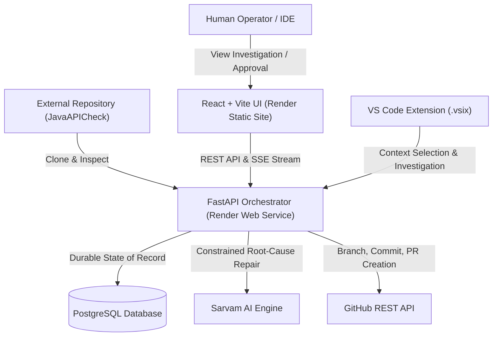

# CodeGuardian — Target Architecture & System Design

## Overview
CodeGuardian is an autonomous failure investigation and software repair engine. When an incident or runtime failure occurs, CodeGuardian ingests the target codebase into an isolated sandbox, traces causal flow from symptom to root cause, synthesizes a counterfactual repair candidate via Sarvam AI, deterministically verifies the repair through sandboxed replay and compilation, requires human operator sign-off, and delivers a validated GitHub Pull Request with persistent memory immunization.

---

## High-Level Topology

---

## 17-Stage Canonical Execution Pipeline

1. **01 Repository:** Snapshot cloning into isolated run workspace.
2. **02 Inspection:** Static code analysis, source tree indexing, and manifest parsing.
3. **03 Architecture:** Microservice topology detection and dependency graph mapping.
4. **04 Failure Detection:** Defect reproduction and runtime telemetry capture.
5. **05 Evidence:** Structured stack traces, request payloads, and exception parsing.
6. **06 GhostTrace:** Causal chain reconstruction distinguishing symptoms from root cause.
7. **07 Failure Memory:** Vector memory lookup of historical incident resolutions.
8. **08 Investigation:** Bounded context analysis and prompt synthesis.
9. **09 Patch:** Minimal, defensive patch synthesis adhering to codebase conventions.
10. **10 Compatibility:** Deterministic safety checks (syntax, path bounds, API contracts).
11. **11 Replay:** Sandboxed re-execution verifying baseline failure resolution.
12. **12 Build:** Isolated container compilation with zero error tolerance.
13. **13 Tests:** Unit and integration regression suite validation.
14. **14 Validation:** Deterministic safety gate matrix evaluation (6/6 gates).
15. **15 Human Approval:** Operator gate controlling downstream delivery.
16. **16 Delivery:** Git feature branch creation, commit, and GitHub Pull Request publication.
17. **17 Memory Update:** Incident fingerprint and proven resolution persisted for immunization.
